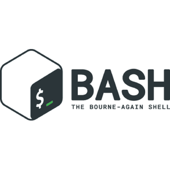
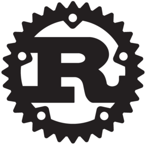
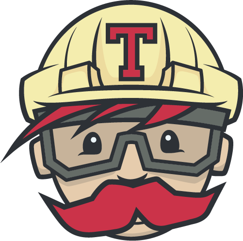

### Hi there 👋

I am a front-end developer, always learning new things, ready for discussions and making new projects.
Here are some ideas to get you started:

### Programming Languages 🌐

- Know/Using
  | 
  | 
  | 

- Learning
  | 
  | 

### Tools 🛠️

- Know/Using
  | 
  | 
  | 
  | 

- Learning
  | 
  |
  | 

### Other Accounts 📫

You can find and get touch with me on these accounts!
| 
